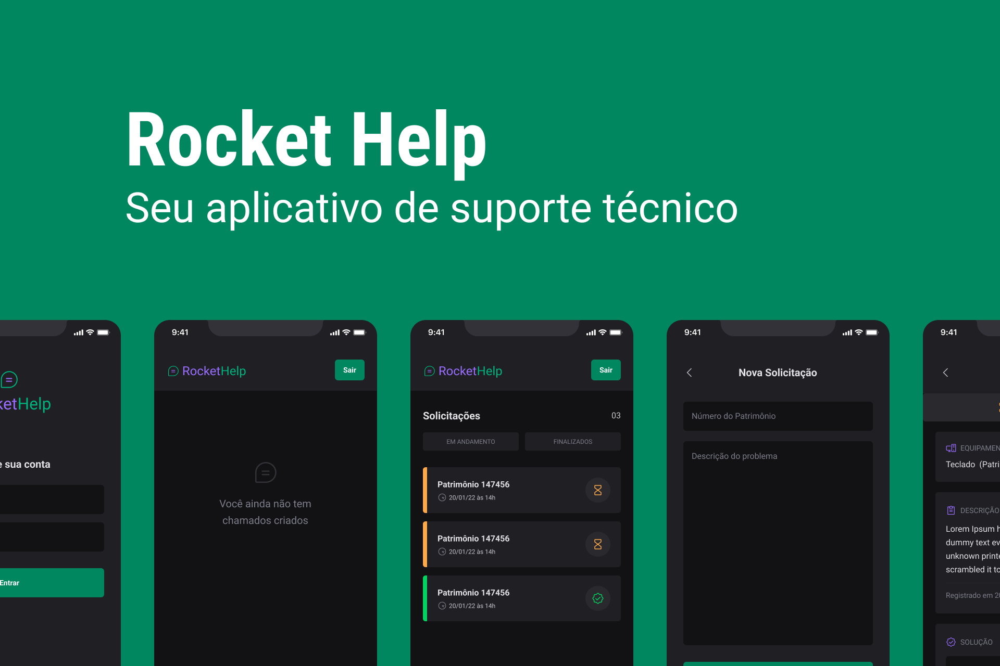

<p align="center">
  
</p>

<p align="center">
  <a href="#-tecnologias">Tecnologias</a>&nbsp;&nbsp;&nbsp;|&nbsp;&nbsp;&nbsp;
  <a href="#-projeto">Projeto</a>&nbsp;&nbsp;&nbsp;|&nbsp;&nbsp;&nbsp;
  <a href="#memo-licença">Licença</a>
</p>

<p align="center">
 
  
  

  
</p>


## 📝 Descrição

Aplicação criada para ajudar no controle de solicitações de suporte técnico 🔧

## ⚡️ Iniciando o Projeto

### Clonando Projeto
```bash
git clone https://github.com/RennanD/rockethelp.git
```

### Requisitos

* [Node](https://nodejs.org/en/)
* [Yarn](https://classic.yarnpkg.com/lang/en/docs/install/#debian-stable) (Opicional)

### Instalando Dependências  
* Utilizando NPM 
```bash
npm install
```

* Utilizando Yarn 
```bash
yarn
```

### Configurando o ambiente

Para testar o aplicativo é importante ter seu ambiente devidamente configurado, seguindo [esses passos](https://react-native.rocketseat.dev/) você pode deixar pronto para rodar a aplicação.

### Iniciando Projeto  
* Utilizando NPM 
```bash
npm run android
```

* Utilizando Yarn 
```bash
yarn android
```

Obs.: Por enquanto o app está testável somente no ambiente Android ⚡️

## 🚀 Tecnologias

- [React Native](https://reactnative.dev/)
- [Expo](https://expo.dev/)
- [Native Base](https://nativebase.io/)
- [Firebase](https://firebase.google.com/community?hl=pt)

## 🚧 Projeto

Preview do projeto

<p align="center">
  
</p>


## :memo: Licença

Esse projeto está sob a licença MIT. Veja o arquivo [LICENSE](LICENSE) para mais detalhes.

---

Feito com ♥ by rennand
